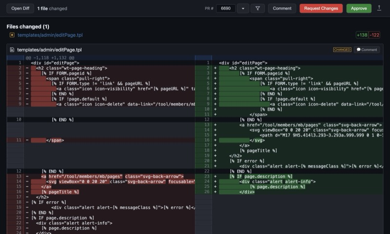
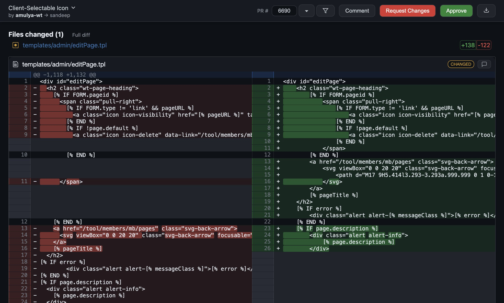
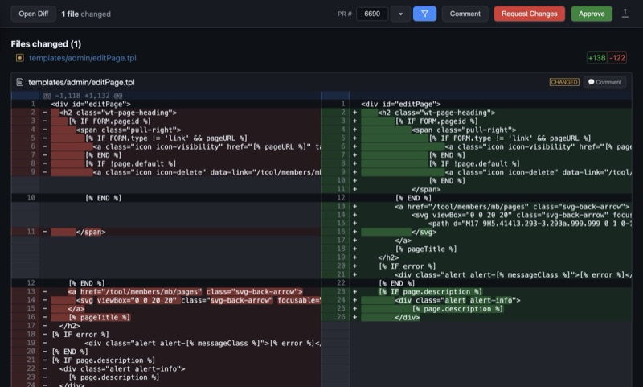
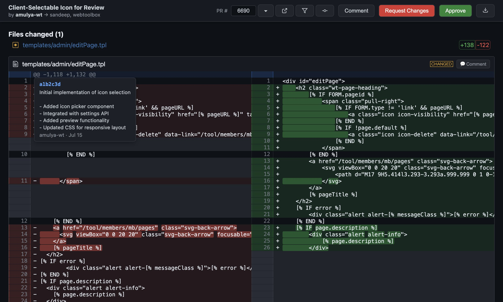
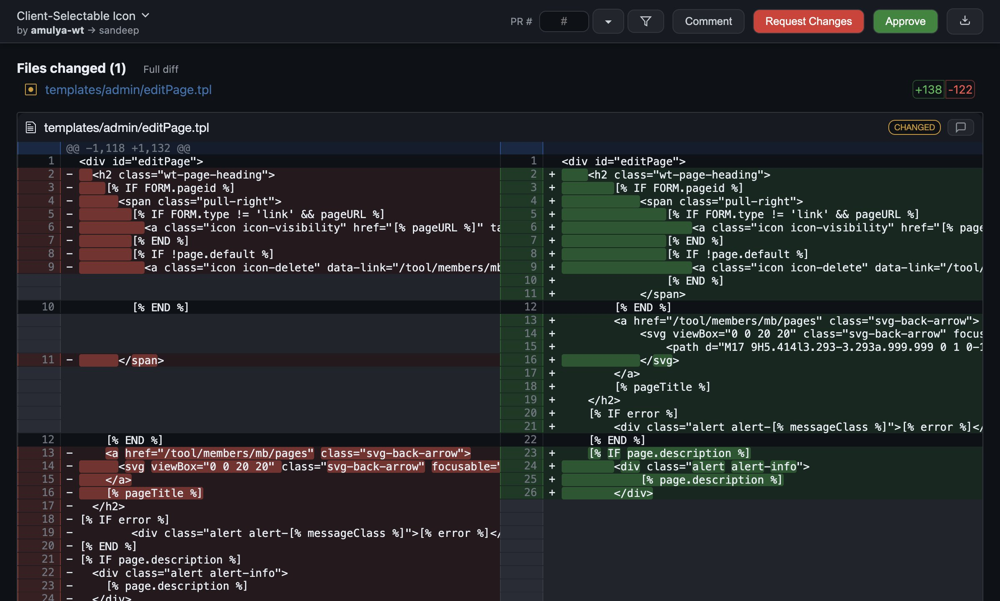
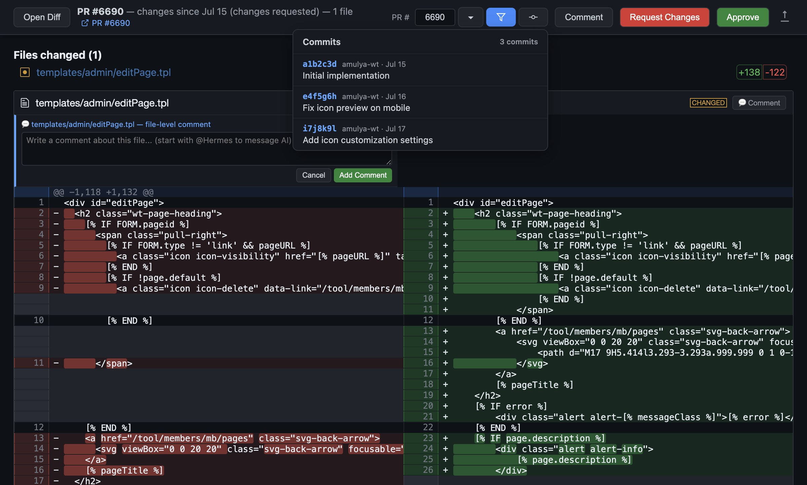

# Diff Reviewer

A macOS desktop app for reviewing GitHub PR diffs with line-level commenting, file-level comments, AI agent integration, and S3 image upload support.



## Features

### Core Review Features
- **Side-by-side diff viewing** powered by diff2html
- **Line-level commenting** on both left (old) and right (new) sides
- **File-level comments** for overall feedback on a file
- **Review body** with optional summary text
- **Three review types**: Comment, Request Changes, Approve
- **Direct GitHub submission** — reviews submitted directly to GitHub via `gh` API
- **Auto-save drafts** — comments survive app restarts
- **Export as markdown** with code context and images

### PR Management
- **PR dropdown** — lists open PRs pending your review



- **Configurable filtering** — by review requested, title contains
- **New window** — open multiple PRs in separate windows simultaneously
- **PR number input** — type a PR number and press Enter to load
- **PR URL link** — click to open the PR in your browser
- **PR info bar** — shows PR title, author, and assignees

### Commits & History
- **Commits panel** — view all commits in the PR with messages



- **Line-level commit tooltips** — hover over line numbers to see which commit changed that line (with configurable delay)


- **Multi-line commit messages** — tooltips show full commit descriptions with body text
- **Commit links** — click any commit to open it in your browser

### File Filtering
- **File extension filter** — filter the diff by file type



- **Configurable defaults** — set your preferred extensions in config
- **Intelligent checkboxes** — only shows extensions found in the current diff

### Commenting
- **Line-level comments** — click the + button on any line


- **File-level comments** — click the comment icon on file headers



- **Image support** — paste (Cmd+V) or drag-and-drop images
- **S3 upload** — images uploaded to S3 for inline GitHub markdown
- **AI agent integration** — tag @Hermes in comments to message an AI agent
- **AI PR context** — when no chat-id is specified, PR number is included in messages for context

### Multi-Window Support
- **File > New Window** (Cmd+N) — open blank Diff Reviewer windows
- **File > Open Diff** (Cmd+O) — open .diff files
- Each window is independent with its own PR/comments
- Open PRs in new windows via the ↗ icon in the dropdown

### macOS Integration
- **Dock icon** with custom diff-style icon
- **File association** — .diff and .patch files open with Diff Reviewer
- **Application menu** with standard macOS shortcuts
- **.app bundle** — install to /Applications like any native app

### Data Management
- **Persistent storage** — all data in `~/Library/Application Support/diff-reviewer/`
  - `reviews/` — submitted review JSONs
  - `drafts/` — auto-saved comment drafts
  - `generated/` — generated PR diff files
  - `images/` — attached images
- **Automatic cleanup** — delete old files based on configurable retention period
- **Default retention**: 6 months (180 days)

## Installation

### From Source
```bash
git clone https://github.com/webtoolbox/diff-reviewer.git
cd diff-reviewer
npm install
npm start
```

### Build .app Bundle
```bash
npm run build
# Creates Diff Reviewer.app in dist/mac-arm64/
# Copy to /Applications/
```

## Configuration

### Config Files

The app uses a two-tier config system:

1. **Public config** (in repo): `config.json` — generic defaults, committed to GitHub
2. **Private config** (user-specific): `~/.config/diff-reviewer/config.json` — your personal settings

Private config overrides public config. Your private config should NOT be committed.

### Config Options

```json
{
  "aiCommand": "hermes",
  "aiSendArgs": ["send", "--to"],
  "aiChatId": null,
  "aiTagPrefix": "@Hermes",
  "reviewSaveDir": "",
  "prFilter": {
    "reviewRequested": true,
    "titleContains": "for review"
  },
  "repoOwner": "",
  "repoName": "",
  "diff": {
    "mode": "since-review",
    "excludeMerges": true,
    "codeFileExtensions": []
  },
  "imageUpload": {
    "enabled": false,
    "provider": "s3",
    "s3Bucket": "",
    "s3Prefix": "",
    "s3Acl": "public-read",
    "awsProfile": "default",
    "awsRegion": "us-east-1"
  },
  "cleanup": {
    "enabled": true,
    "retentionDays": 180,
    "runOnStartup": true
  },
  "style": {
    "rounded": true
  },
  "tooltip": {
    "showDelay": 400,
    "hideDelay": 200
  }
}
```

### Diff Modes

The `diff.mode` config controls how diffs are generated when loading a PR:

- **`since-review`** (default): Shows only changes since the last non-COMMENTED review by the repo owner. Handles dismissed reviews and commit_id mutation. Excludes merge commits. Falls back to full diff if no prior review exists.
- **`full`**: Shows all changes from the PR's base branch to HEAD.

When `since-review` mode is active:
- Paginates through all reviews to find the most recent non-COMMENTED review
- For dismissed reviews, uses commit_id directly (matches GitHub's behavior)
- For non-dismissed reviews, verifies commit_id isn't mutated (commit date > review date)
- If mutated, finds the actual reviewed commit by paginating through commits
- Uses three-dot diff against master to exclude merge noise
- Only includes files changed by authored (non-merge) commits
- Filters to code files only (configurable via `codeFileExtensions`)

### Example Private Config (for Website Toolbox)

```json
{
  "repoOwner": "webtoolbox",
  "repoName": "Website-Toolbox",
  "prFilter": {
    "reviewRequested": true,
    "titleContains": "for review"
  },
  "diff": {
    "mode": "since-review",
    "excludeMerges": true,
    "codeFileExtensions": [".pm", ".cgi", ".js", ".tpl", ".css", ".less", ".json"]
  },
  "imageUpload": {
    "enabled": true,
    "s3Bucket": "pubsharefiles",
    "awsProfile": "mfa",
    "awsRegion": "us-east-1"
  }
}
```

## Usage

### Launching
- **From dock**: Click the Diff Reviewer icon
- **From Applications**: Double-click Diff Reviewer.app
- **From terminal**: `npx electron . /path/to/file.diff`
- **With AI session**: `npx electron . --chat-id "telegram:user / topic 12345" /path/to/file.diff`
- **With PR number**: `npx electron . --pr-number 6690 /path/to/file.diff`

### Opening PRs
1. Click the ▾ button next to the PR number field
2. Select a PR from the dropdown (filtered by your config)
3. Or type a PR number and press Enter

### Adding Comments
1. Hover over a line and click the green + button
2. Type your comment (tag @Hermes to message AI)
3. Optionally paste or drag an image
4. Click "Add Comment" or press Cmd+Enter

### File-Level Comments
1. Click the comment icon next to a file name in the diff header
2. Add your comment about the overall file

### Reviewing
1. Add your comments as above
2. Optionally add a review summary in the text area at the bottom
3. Click "Comment", "Request Changes", or "Approve"
4. AI-tagged comments are sent separately

### Navigation
- **Cmd+[** / **Cmd+]**: Jump between comments
- **Cmd+Shift+Enter**: Submit review
- **Cmd+N**: New window
- **Cmd+O**: Open diff file

### Exporting
- Click the 📤 icon in the top bar to export as markdown
- Images are uploaded to S3 (if configured) and included as URLs

## Data Storage

All app data is stored in:
```
~/Library/Application Support/diff-reviewer/
├── reviews/          # Submitted review JSONs
├── drafts/           # Auto-saved comment drafts
├── generated/        # Generated PR diff files
└── images/           # Attached images
```

Old files are automatically cleaned up based on the `cleanup.retentionDays` config (default: 180 days / 6 months).

## Development

### Running Tests
```bash
npm test
```

### Building
```bash
npm run build        # Build .app bundle
npm run build:dir    # Build unpacked directory
```

### Project Structure
```
├── main.js           # Electron main process
├── preload.js        # IPC bridge
├── renderer.js       # UI logic
├── index.html        # UI layout and styles
├── test.js           # Test suite
├── config.json       # Public config
├── icon.png          # App icon
├── package.json      # Dependencies and build config
├── screenshots/      # App screenshots for documentation
└── README.md         # This file
```

## License

MIT License - see [LICENSE](LICENSE) for details.

## Contributing

See [CONTRIBUTING.md](CONTRIBUTING.md) for guidelines.
