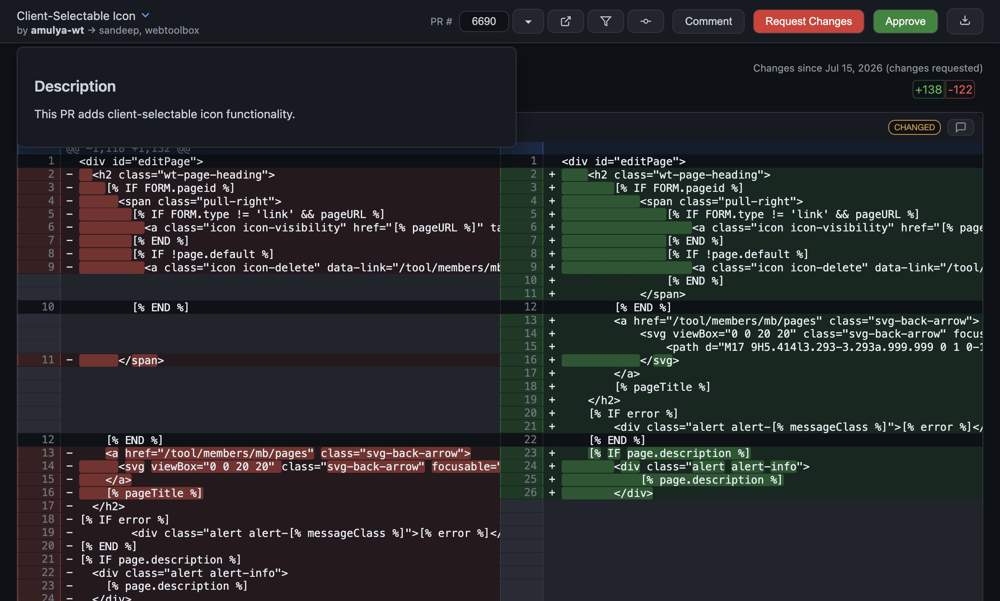
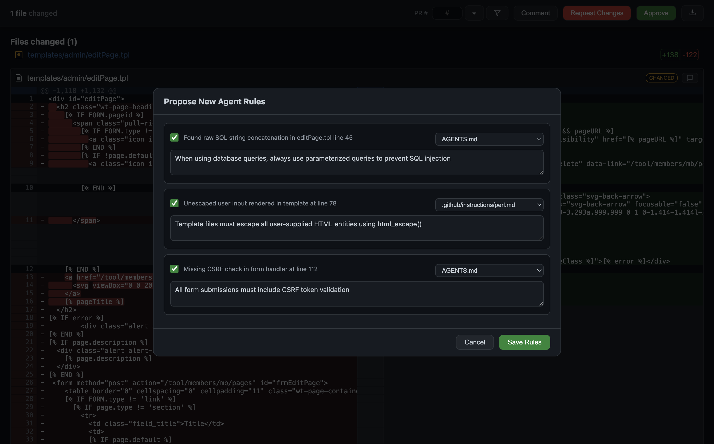

# PR Reviewer

A desktop AI-native diff reviewer for GitHub PRs with voice commands, desktop AI agent integration, and automatic PR and agent rule creation based on review comments. Speeds up reviews by loading diffs immediately, excluding merge commits, and auto-loading the next PR.


## Why PR Reviewer?
Reviewing PRs on GitHub means clicking into a PR, reading the description, scanning commits and comments, then navigating to the Files Changed tab before you can even see the diff. PR Reviewer skips all of that — it loads the diff immediately and automatically moves to the next PR when you're done.

**Desktop AI agent integration**: Tag @hermes (or any other supported agent) in any comment to message a desktop AI agent directly from the review. The agent can help with code analysis, answer questions, or assist with changes. Use @ask to get the response displayed inline in the app. Supported agents: **Hermes**, **Claude Code**, **Cursor**, **GitHub Copilot CLI**, **Aider**, and **Codex CLI**.

**Voice commands**: Press Ctrl+B to speak review commands naturally. Add line comments, file comments, approve PRs, request changes, ask questions about code — all via voice. The AI interprets your spoken instructions and executes them on the review.

**Before/after design comparison**: When a PR description contains before/after screenshot pairs, a comparison icon appears next to the title. Click it to open a full-screen slideshow with side-by-side images, navigation arrows, and click-to-zoom for detailed inspection.

**Automated agent rule proposals**: After submitting a review, the app can analyze your feedback against the repo's AGENTS.md rules and propose new rules when needed. This replaces a workflow that was previously done manually — reviewing feedback, identifying gaps in agent rules, and updating the rule files.

**Faster review workflow**: Open the app and start reviewing right away. No multi-step navigation. When you finish one PR, the next one loads automatically.

**No merge commit noise**: Diffs automatically exclude merge commits, so you only see the actual code changes. GitHub's diff can sometimes be cluttered with merge commit diffs that make it harder to review.

**Line-level commit attribution**: Hover over any line to see exactly which commit changed it and why. This makes it easy to trace the history of a specific change without digging through git blame.

**Configurable file pre-filtering**: On GitHub, all files are shown by default and you have to manually unselect file types you don't need to review every time. PR Reviewer lets you configure default file extensions so only relevant files show up. You can also use the file extension filter pane to override that for a specific PR.

## Features
### AI-Native Features
- **Voice commands** — press Ctrl+B to speak review commands naturally. Add comments, approve, request changes, ask questions — all via voice. Powered by Hermes STT and LLM interpretation.
- **Before/after design comparison** — PR descriptions with before/after screenshot pairs get a comparison icon. Click to open a full-screen slideshow with side-by-side images, navigation arrows, and click-to-zoom.


- **Desktop AI agent integration** — tag @hermes (or any other supported agent) in any comment to message a desktop AI agent directly from the review. Use @ask to get the response displayed inline.
- **Supported AI agents**: Hermes, Claude Code, Cursor, GitHub Copilot CLI, Aider, Codex CLI — select your preferred agent in Preferences > AI Agent
- **Auto-fix with AI** — when requesting changes, review comments are sent to the configured AI agent which creates a new PR with the necessary fixes
- **Automated agent rule proposals** — after submitting a review, AI analyzes feedback against AGENTS.md and proposes new rules

### Core Review Features
- **Side-by-side diff viewing** powered by diff2html
- **Line-level commenting** on both left (old) and right (new) sides
- **File-level comments** for overall feedback on a file
- **Three review types**: Comment, Request Changes, Approve
- **Direct GitHub submission** — reviews submitted directly to GitHub
- **Auto-save drafts** — comments survive app restarts
- **Export as markdown** with code context and images

### PR Management
- **PR dropdown** — lists open PRs pending your review


- **PR description dropdown** — ▾ button next to title shows the full PR description with markdown rendering



- **Configurable filtering** — by review requested, title contains
- **Open PRs in new windows** via the ↗ icon in the dropdown

### Commits & History
- **Commits panel** — view all commits in the PR with messages


- **Line-level commit attribution** — hover over line numbers to see which commit changed that line


### File Filtering
- **File extension pre-filter** — filter the diff by file type
- **File name filter** — type a partial file name to show only matching files


### Commenting
- **Line-level comments** — click the + button on any line


- **File-level comments** — click the comment icon on file headers


- **Image support** — paste (Cmd+V) or drag-and-drop images into comments
- **S3 upload** — images uploaded to S3 for inline GitHub markdown
- **User mentions** — type @ in any comment to get an autosuggest dropdown of repo collaborators. Select a collaborator to insert @username. Fetches real collaborators via the GitHub API.


### Auto-fix with AI
- **Automatic PR creation** — review comments are sent to the configured AI agent which creates a new PR with the necessary fixes
- **Supported agents**: Hermes, Claude Code, Cursor, GitHub Copilot CLI, Aider, Codex CLI
- **Follows repo guidelines** — the agent follows the AGENTS.md file in the repository
- **Participant management** — all PR participants (author, assignees, reviewers) except the reviewer are added to the new PR
- **Configurable** — enable/disable via `autoFix.enabled` in config.json (enabled by default)

### Agent Rules
- **Rules proposal** — after submitting a review, AI analyzes feedback against AGENTS.md and proposes new rules
- **Configurable** — enable/disable via `rules.enabled` in config.json



### Multi-Window Support
- **New windows** (Cmd+N) — open multiple PRs in separate windows simultaneously
- **File association** — .diff and .patch files open with PR Reviewer

### Platform Integration
- **macOS**: .app bundle, dock icon, file associations for .diff/.patch
- **Linux**: Run from source or build .deb/.rpm/.AppImage
- **Windows**: Run from source or build .exe installer/portable

### Data Management
- **Persistent storage** — all data stored locally:
  - macOS: `~/Library/Application Support/pr-reviewer/`
  - Linux: `~/.config/pr-reviewer/`
  - Windows: `%APPDATA%\pr-reviewer\`
  - `reviews/` — submitted review JSONs
  - `drafts/` — auto-saved comment drafts
  - `generated/` — generated PR diff files
  - `images/` — attached images
- **Automatic cleanup** — delete old files based on configurable retention period
- **Default retention**: 6 months (180 days)

## Installation

### Prerequisites
- **GitHub CLI (gh)** — required. Must be authenticated (`gh auth login`). The app checks for `gh` on startup and shows install instructions if missing.
- **One AI agent** — required for auto-fix and review features. The app auto-detects the first available agent on first launch. Supported:
  - [Hermes](https://github.com/NousResearch/hermes-agent) — `npm install -g @nousresearch/hermes-agent`
  - [Claude Code](https://docs.anthropic.com/en/docs/claude-code) — `npm install -g @anthropic-ai/claude-code`
  - [Cursor](https://cursor.sh) — `brew install --cask cursor`
  - [GitHub Copilot CLI](https://githubnext.github.com/copilot-cli) — `npm install -g @githubnext/copilot-cli`
  - [Aider](https://aider.chat) — `pip install aider-chat`
  - [Codex CLI](https://github.com/openai/codex) — `npm install -g @openai/codex`

### Pre-built Applications
Pre-built applications are available for download from [GitHub Actions](https://github.com/webtoolbox/pr-reviewer/actions). Each build produces platform-specific installers:

- **macOS**: `.dmg` installer
- **Linux**: `.deb` package
- **Windows**: `.exe` installer

Download the latest build for your platform, install, and you're ready to go.

### Build from Source
#### Prerequisites
- **Node.js** 18+ and npm
- **git** and **gh** (GitHub CLI) — `gh` must be authenticated (`gh auth login`)

#### macOS

#### From Source
```bash
git clone https://github.com/webtoolbox/pr-reviewer.git
cd pr-reviewer
npm install
npm start
```

#### Build .app Bundle
```bash
npm run build
# Creates PR Reviewer.app in dist/mac-arm64/
# Copy to /Applications/
```

### Linux
```bash
git clone https://github.com/webtoolbox/pr-reviewer.git
cd pr-reviewer
npm install
npm start
```

#### Build Linux Package (optional)
```bash
npx electron-builder --linux
# Creates .deb, .rpm, or .AppImage in dist/
```

#### Data Storage (Linux)
App data is stored in `~/.config/pr-reviewer/` instead of the macOS path.

### Windows

#### From Source
```bash
git clone https://github.com/webtoolbox/pr-reviewer.git
cd pr-reviewer
npm install
npm start
```

#### Build Windows Package (optional)
```bash
npx electron-builder --win
# Creates .exe installer and portable version in dist/
```

#### Prerequisites
- **Node.js** 18+ and npm
- **git** and **gh** (GitHub CLI) — `gh` must be authenticated (`gh auth login`)

#### Data Storage (Windows)
App data is stored in `%APPDATA%\pr-reviewer\` (typically `C:\Users\<username>\AppData\Roaming\pr-reviewer\`).

## Configuration

### Config Files

The app uses a two-tier config system:

1. **Public config** (in repo): `config.json` — generic defaults, committed to GitHub
2. **Private config** (user-specific): `~/.config/pr-reviewer/config.json` — your personal settings

Private config overrides public config. Your private config should NOT be committed.

### Config Options
```json
{
  "aiCommand": "hermes",
  "aiSendArgs": ["send", "--to"],
  "aiChatId": null,
  "aiTagPrefix": "@Hermes",
  "reviewSaveDir": "",
  "prFilter": {
    "reviewRequested": true,
    "titleContains": "for review"
  },
  "repos": [
    { "owner": "webtoolbox", "name": "Website-Toolbox", "checked": true }
  ],
  "repoOwner": "",
  "repoName": "",
  "diff": {
    "mode": "since-review",
    "excludeMerges": true,
    "codeFileExtensions": []
  },
  "imageUpload": {
    "enabled": false,
    "provider": "s3",
    "s3Bucket": "",
    "s3Prefix": "",
    "s3Acl": "public-read",
    "awsProfile": "default",
    "awsRegion": "us-east-1"
  },
  "cleanup": {
    "enabled": true,
    "retentionDays": 180,
    "runOnStartup": true
  },
  "style": {
    "rounded": true
  },
  "tooltip": {
    "showDelay": 400,
    "hideDelay": 200
  },
  "rules": {
    "enabled": false
  }
}
```

### Diff Modes
The `diff.mode` config controls how diffs are generated when loading a PR:

- **`since-review`** (default): Shows only changes since the last non-COMMENTED review by the repo owner. Handles dismissed reviews and commit_id mutation. Excludes merge commits. Falls back to full diff if no prior review exists.
- **`full`**: Shows all changes from the PR's base branch to HEAD.

When `since-review` mode is active:
- Paginates through all reviews to find the most recent non-COMMENTED review
- For dismissed reviews, uses commit_id directly (matches GitHub's behavior)
- For non-dismissed reviews, verifies commit_id isn't mutated (commit date > review date)
- If mutated, finds the actual reviewed commit by paginating through commits
- Uses three-dot diff against master to exclude merge noise
- Only includes files changed by authored (non-merge) commits
- Filters to code files only (configurable via `codeFileExtensions`)

## Usage

### Launching
- **From dock**: Click the PR Reviewer icon
- **From Applications**: Double-click PR Reviewer.app
- **From terminal**: `npx electron . /path/to/file.diff`
- **With AI session**: `npx electron . --chat-id "telegram:user / topic 12345" /path/to/file.diff`
- **With PR number**: `npx electron . --pr-number 6690 /path/to/file.diff`

### Opening PRs
1. Click the ▾ button next to the PR number field
2. Select a PR from the dropdown (filtered by your config)
3. Or type a PR number and press Enter

### Adding Comments
1. Hover over a line and click the green + button
2. Type your comment (tag @hermes to message AI, @ask for inline response)
3. Optionally paste or drag an image
4. Click "Add Comment" or press Cmd+Enter

### File-Level Comments
1. Click the comment icon next to a file name in the diff header
2. Add your comment about the overall file

### Reviewing
1. Add your comments as above
2. Optionally add a review summary in the text area at the bottom
3. Click "Comment", "Request Changes", or "Approve"
4. AI-tagged comments are sent separately

### Navigation
- **Cmd+[** / **Cmd+]**: Jump between comments
- **Cmd+Shift+Enter**: Submit review
- **Cmd+N**: New window
- **Cmd+O**: Open diff file

### Exporting
- Go to File > Export Review > As Markdown (Cmd+Shift+E) or As JSON (Cmd+Shift+J)
- Images are uploaded to S3 (if configured) and included as URLs

## Data Storage

All app data is stored in:
```
~/Library/Application Support/pr-reviewer/
├── reviews/          # Submitted review JSONs
├── drafts/           # Auto-saved comment drafts
├── generated/        # Generated PR diff files
└── images/           # Attached images
```

Old files are automatically cleaned up based on the `cleanup.retentionDays` config (default: 180 days / 6 months).

## Development

### Running Tests
```bash
npm test
```

### Building
```bash
npm run build        # Build .app bundle
npm run build:dir    # Build unpacked directory
```

### Project Structure
```
├── main.js           # Electron main process
├── preload.js        # IPC bridge
├── renderer.js       # UI logic
├── index.html        # UI layout and styles
├── test.js           # Test suite
├── config.json       # Public config
├── icon.png          # App icon
├── package.json      # Dependencies and build config
├── screenshots/      # App screenshots for documentation
└── README.md         # This file
```

## License

MIT License - see [LICENSE](LICENSE) for details.

## Contributing

See [CONTRIBUTING.md](CONTRIBUTING.md) for guidelines.
